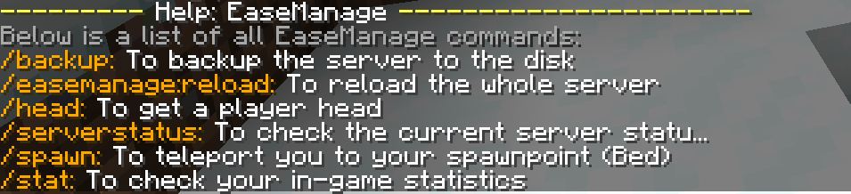

# EaseManage

## Overview
**This plugin is still in public beta.**

### Introduction
EaseManage is a Minecraft plugin for Vanilla survival / SMP, aims to provide server owner / administrator a better and easily acessible tool. Also, GUI tools for improving player experience have also been implemented.

### Required Version
Minecraft Spigot/Bukkit Server  1.18
This plugin is tested in 1.18.1 environment

### Features
The plugin includes the following:
- **Check Server Status (Ping / TPS)**
- **Get Player Head**
- **Player statistics check with GUI**
- **/spawn with cooldown settings (1800s)**
- **AutoMessage**
- **Display name change**
- **Auto backup / Backup command**

## Detailed Information

### Command
This plugin used the following command name:
- /spawn : Teleport you to the spawnpoint (Permission: easemanage.spawn.use)
- /stat : Check your player statistics in this world (Permission: easemanage.stat.use)
- /serverstatus {TPS/ping} : Check the server status (Permission: easemanage.serverstatus.use)
- /backup : Backup the worlds in the server folder (Permission: easemanage.backup.use)
- /head <playerName> : Get a player's head (Permission: easemanage.head.use)




### Features
This plugin provides the following features:
- AutoBackup with customizable interval and maximum number of backups
- AutoMessage with customizable interval and message
- DisplayName with customizable group of player and prefix / color settings

### Choosing the right features / commands
If you find that you want to change any settings regarding to this plugin, please change it in config.yml located in `/plugin/EaseManage/`

### Permissions

All player grant the following permission by default:
- easemanage.spawn.use
- easemanage.serverstatus.use
- easemanage.stat.use

All server operators (op) grant the following permission by default:
- easemanage.head.use
- easemanage.reload.use
- easemanage.announce.use
- easemanage.backup.use

## Getting Started

To get start with, download the release verison of the plugin, and put it in the `plugin` folder.

### Config.yml
**Please follow the comments provided in config.yml, otherwise exception / unexpected behavior may occur**

#### Settings on enabling / disabling a command
```yaml
# Each command requires a boolean to indicate whether the command is enabled
# If a command is disabled, ALL players cannot execute that command
# true = enable
# false = disable
# REQUIRED : boolean
command-enable:
  serverstatus: true
  head: true
  spawn: true
  announcement: true
  stat: true
  backup: true
```
#### AutoMessage Features
The settings are located at `features.auto-message` in `config.yml`
```yaml
  auto-message:
   # Indicate whether thhe auto-message feature will be enabled or not
   # REQUIRED : boolean
    enable: true
	#Indicate the interval of each auto-message (seconds)
	# REQUIRED : int 
    interval: 180 
    
# Color code for messages starts at '&', followed by the chat code indicator
# For more info, check https://www.digminecraft.com/lists/color_list_pc.php
# Note that we replace all '§' to '&'
# REQUIRED WHEN ENABLE: String
    msgs:
      - "&bTIPS: Use /spawn can back to your spawnpoint"
      - "&bTIPS: Use /stat can see your own statistics"
      - "&bTIPS: Use /serverstatus can check the current status of the server"
```
If we want to add one more message `"EaseManage is a good plugin!"` without changing the message color, we should change the `features.auto-message.msgs` as follows:
```yaml
msgs:
      - "&bTIPS: Use /spawn can back to your spawnpoint"
      - "&bTIPS: Use /stat can see your own statistics"
      - "&bTIPS: Use /serverstatus can check the current status of the server"
	  - "EaseManage is a good plugin!"
```

#### AutoBackup
The settings are located at `features.auto-backup` in `config.yml`
```yaml
auto-backup:
	# Indicate whether the auto-backup function enables or not
	# REQUIRED : int
    enable: true
	# Indicates the interval of each backup in seconds
	# REQUIRED WHEN ENABLE : int
    interval: 7200
    
    # Max number of backups that you want to save in your disk
    # If the maximum number is reached, then EaseNabage will remove the 
    # oldest backup in your disk (Oldest creation date)
    # indicate -1 if you don't want to delete any backup
    # REQUIRED WHEN ENABLE : int
    max-backups: 10
```

#### Display Name
Currently, we only support changing the prefix and the player color name. Those settings are loacted at `features.display-name` in `config.yml`.
```yaml
  display-name:
   # Indicate whether this function is enabled or not
   # REQUIRED : boolean
    enable: true
    group:
    # List of an object
    # REQUIRED WHEN ENABLE
    # See the following example
      -
        prefix: "&c[EaseManage] "
        colorCode: "&d"
        playerNames: ["Oscar0713"]
```
We need to have the exact key `prefix`, `colorCode`, `playerNames` in each of the element in the list.

Example: If we want to add a player "abcd1234" with his display name changes to green. We should set the `features.display-name.group` as follows:
```yaml
    group:
    # List of an object
    # REQUIRED WHEN ENABLE
    # See the following example
    
      -
        prefix: "&c[EaseManage] "
        colorCode: "&d"
        playerNames: ["Oscar0713"]
      -
        prefix: ""
        colorCode: "&a"
        playerNames: ["abcd1234"]
```

## Bug report / Issue report / Suggestions
If you have any issues or suggestions related to this plugin, please send an email to [oscartse001@gmail.com](mailto:oscartse001@gmail.com "oscartse001@gmail.com"), or simply create an issue in GitHub.

#### To-Do List in future updates
- Add GUI for config.yml
- Add more player statistics
- Provide customizable PlayerTab List
