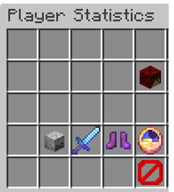

# EaseManage

## Overview
**This plugin is still in public beta.**

### Introduction
EaseManage is a Minecraft plugin for Vanilla survival / SMP, aims to provide server owner / administrator a better and easily acessible tool. Also, GUI tools for improving player experience have also been implemented.

### Required Version
Minecraft Spigot/Bukkit Server  1.18
This plugin is tested in 1.18.1 environment

### Features
The plugin includes the following:
- **Check Server Status (Ping / TPS)**
- **Get Player Head**
- **Player statistics check with GUI**
- **/spawn with cooldown settings**
- **AutoMessage**
- **Custom relaod / restart announcement**
- **Display name change**
- **Auto backup / Backup command**

## Detailed Information

### Command
This plugin used the following command name:
- /spawn : Teleport you to the spawnpoint (Permission: easemanage.spawn.use)
- /stat : Check your player statistics in this world (Permission: easemanage.stat.use)
- /serverstatus {TPS/ping} : Check the server status (Permission: easemanage.serverstatus.use)
- /backup : Backup the worlds in the server folder (Permission: easemanage.backup.use)
- /head <playerName> : Get a player's head (Permission: easemanage.head.use)

### Features
This plugin provides the following features:
- AutoBackup with customizable interval and maximum number of backups
- AutoMessage with customizable interval and message
- DisplayName with customizable group of player and prefix / color settings

### Choosing the right features / commands
If you find that you want to change any settings regarding to this plugin, please change it in config.yml located in `/plugin/EaseManage/`

### Permissions

All player grant the following permission by default:
- easemanage.spawn.use
- easemanage.serverstatus.use
- easemanage.stat.use

All server operators (op) grant the following permission by default:
- easemanage.head.use
- easemanage.reload.use
- easemanage.announce.use
- easemanage.backup.use

## Getting Started

To get start with, download the release verison of the plugin, and put it in the `plugin` folder.

### Config.yml
**Please follow the comments provided in config.yml, otherwise exception / unexpected behavior may occur**

## Bug report / Issue report / Suggestions
If you have any issues or suggestions related to this plugin, please send an email to [oscartse001@gmail.com](mailto:oscartse001@gmail.com "oscartse001@gmail.com"), or simply create an issue in GitHub.

#### To-Do List in future updates
- Add GUI for config.yml
- Add more player statistics
- Provide customizable PlayerTab List
